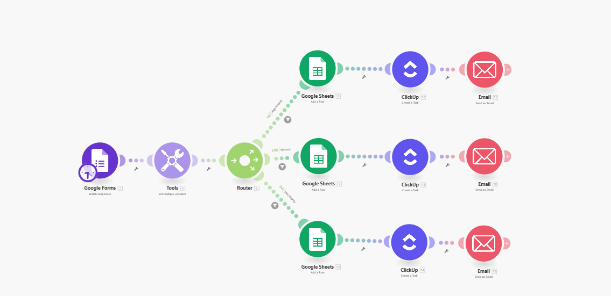

# Multi-Client Intake Automation using Make.com

This automation streamlines the client intake process for multiple departments using Make.com, Google Forms, ClickUp, and Google Sheets.

## Workflow Highlights:
- Google Form submission triggers the scenario
- Cleans and processes form data
- Routes requests to the right team via conditional Router
- Creates a task in ClickUp
- Logs details into a Google Sheet
- Sends confirmation email to the client

## Tools Used
- Make.com
- Google Forms + Google Sheets
- ClickUp
- Make Email Module (SMTP or OAuth)

## Scenario Screenshot

## Sample Data
See `sample-data.csv` for sample form responses used for testing.

## Email Template
See `client-email-template.md` for automated email body used.

## Result
Reduced intake processing time by 90%, improved team response speed, and made onboarding scalable across clients.

